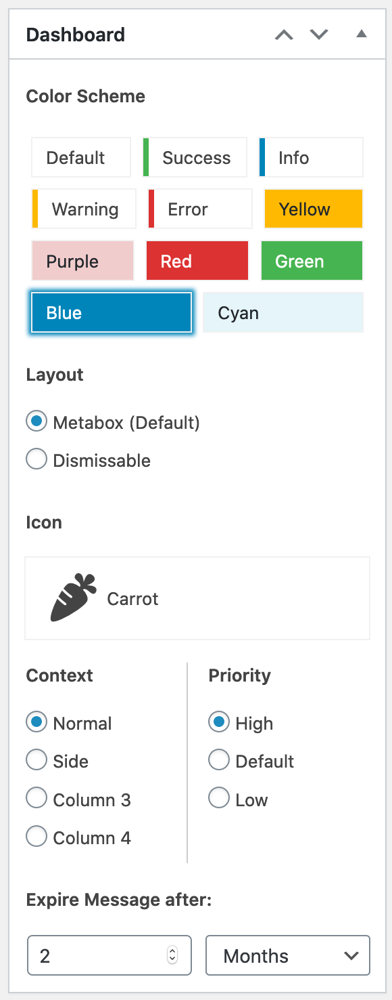

WordPress Dashboard Messages
============================

Show Messages on the WP Admin Dashboard.

Features
--------
 - Select colorset and dashicon
 - WP Multisite support for network-wide messages




For specific target groups you can combine this plugin with
[WP Access Areas](https://wordpress.org/plugins/wp-access-areas/).

Current Status
--------------
The plugin has been submitted to the wordpress plugin repository and is currently undergoing the review process. Once approved it will be available under [https://wordpress.org/plugins/wp-dashboard-messages](https://wordpress.org/plugins/wp-dashboard-messages).

Installation
------------
### Production (using Github Updater – recommended for Multisite)
 - Install [Andy Fragen's GitHub Updater](https://github.com/afragen/github-updater) first.
 - In WP Admin go to Settings / GitHub Updater / Install Plugin. Enter `mcguffin/wp-dashboard-messages` as a Plugin-URI.

### Development
cd into your plugin directory
```
git clone git@github.com:mcguffin/wp-dashboard-messages.git
cd wp-dashboard-messages
npm install
gulp
```

Plugin-API
----------

##### Filter `dashboard_messages_color_schemes`

Example:
```
function add_a_nice_color( $colors ) {
    $colors['nice'] = array(
        'label' => 'Urgh!',
        'css' => 'font-family:fantasy',
    );
    return $colors;
}
add_filter('dashboard_messages_color_schemes','add_a_nice_color');
```
