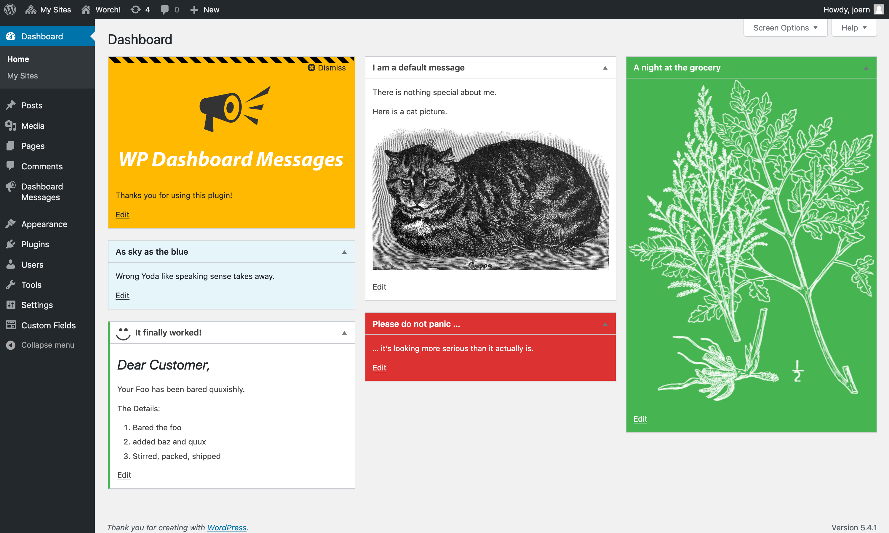

WordPress Dashboard Messages
============================

This is the official github repository of the [WP Dashboard Messages](https://wordpress.org/plugins/wp-dashboard-messages/) plugin.

You can place Messages on the WP Admin Dashboard, including but not limited to cat pictures.



Features
--------
 - Select colorset, layout and dashicon
 - Multisite support for network-wide messages

For specific target groups – like user roles – you can combine this plugin with
[WP Access Areas](https://wordpress.org/plugins/wp-dashboard-messages/).

Installation
------------
### Production
Just follow the [Automatic Plugin Installation](https://wordpress.org/support/article/managing-plugins/#automatic-plugin-installation) procedere.

### Development
cd into your plugin directory
```
git clone git@github.com:mcguffin/wp-dashboard-messages.git
cd wp-dashboard-messages
npm install
npm run dev
```

Plugin-API
----------

##### Filter `dashboard_messages_color_schemes`

Example:
```
function add_a_nice_color( $colors ) {
    $colors['nice'] = array(
        'label' => 'Urgh!',
        'css' => 'font-family:fantasy',
    );
    return $colors;
}
add_filter('dashboard_messages_color_schemes','add_a_nice_color');
```
